# Exercise 1: MCP servers and coding agents

In this exercise, you'll set up a development environment, connect a coding agent to public MCP servers, and then try an authenticated MCP server.

- [Step 1: Set up your development environment](#step-1-set-up-your-development-environment)
- [Step 2: Set up a coding agent](#step-2-set-up-a-coding-agent)
- [Step 3: Use a public MCP server (no auth)](#step-3-use-a-public-mcp-server-no-auth)
- [Step 4: Use an authenticated MCP server (GitHub)](#step-4-use-an-authenticated-mcp-server-github)

---

## Step 1: Set up your development environment

Pick **one** of the options below to get the tutorial repository open and ready.

### Option A: GitHub Codespaces (recommended)

Everything is pre-configured — no local installs needed. You just need a [GitHub account](https://github.com/).

1. Login to your GitHub account.
2. Go to [github.com/pamelafox/pycon2026-mcp-tutorial](https://github.com/pamelafox/pycon2026-mcp-tutorial).
3. Click **Code → Codespaces → Create codespace on main**.

   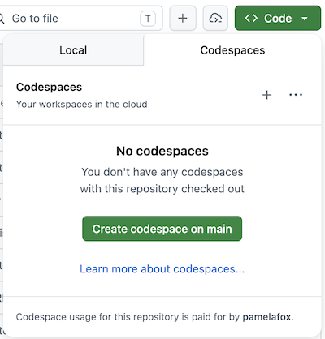

4. Wait for the Codespace to build. Once the editor loads, you're ready to move on to [Step 2](#step-2-set-up-a-coding-agent).

### Option B: VS Code + Dev Containers

This runs the same pre-configured environment locally inside a Docker container.

**Prerequisites:**

- [VS Code](https://code.visualstudio.com/) installed
- [Docker Desktop](https://www.docker.com/products/docker-desktop/) installed and running
- [Dev Containers extension](https://marketplace.visualstudio.com/items?itemName=ms-vscode-remote.remote-containers) installed in VS Code

**Steps:**

1. Clone the repository:

   ```bash
   git clone https://github.com/pamelafox/pycon2026-mcp-tutorial.git
   ```

2. Open the folder in VS Code:

   ```bash
   code pycon2026-mcp-tutorial
   ```

3. When prompted "Reopen in Container", click **Reopen in Container**. (Or open the Command Palette and run **Dev Containers: Reopen in Container**.)
4. Wait for the container to build. Once the editor reloads, you're ready to move on to [Step 2](#step-2-set-up-a-coding-agent).

### Option C: Local environment

If you prefer to work without Docker or Codespaces, you can set up a local Python environment.

**Prerequisites:**

- [uv](https://docs.astral.sh/uv/getting-started/installation/): Python package manager that can also download Python if you don't yet have it instaalled.

**Steps:**

1. Clone (or download) the repository:

   ```bash
   git clone https://github.com/pamelafox/pycon2026-mcp-tutorial.git
   cd pycon2026-mcp-tutorial
   ```

2. Install dependencies:

   ```bash
   uv sync
   ```

3. Open the folder in your editor of choice (VS Code, PyCharm, etc.). Once the editor loads, you're ready to move on to [Step 2](#step-2-set-up-a-coding-agent).

---

## Step 2: Set up a coding agent

Set up **one** of the coding agents from instructions below, either [GitHub Copilot in VS Code / Codespaces](#option-a-github-copilot-in-vs-code--codespaces), [GitHub Copilot CLI](#option-b-github-copilot-cli), or [Claude Code](#option-c-claude-code). You are welcome to use another MCP-compatible coding agent if you have one installed, but agents vary in how fully they support MCP features, so you may encounter issues.

### Option A: GitHub Copilot in VS Code / Codespaces

1. Check the right side of VS Code to see if the Copilot Chat side panel is already open. If it's not open, find the "Toggle Chat" icon at the top of VS Code, locate and click it to open the side panel.

   

   > 🪧 **Note:** If this is your first time using GitHub Copilot, you will need to accept the usage terms to continue.

2. Make sure the chat is in **Agent** mode. (You may not see "Agent", but you should see a loop icon which says "Agent" upon clicking.)

   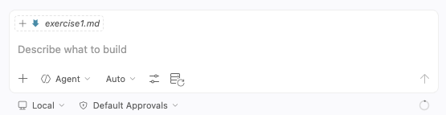

3. Send a test message "Hello" to confirm the agent is working.
4. Move on to [Step 3](#step-3-use-a-public-mcp-server-no-auth)

### Option B: GitHub Copilot CLI

> You need a [GitHub Copilot subscription](https://github.com/features/copilot) for this option.

1. Install GitHub Copilot CLI by following the [installation guide](https://docs.github.com/en/copilot/how-tos/copilot-cli/set-up-copilot-cli/install-copilot-cli).
2. Verify the installation:

   ```bash
   copilot
   ```

3. Move on to [Step 3](#step-3-use-a-public-mcp-server-no-auth)

### Option C: Claude Code

> You need a [Claude Code](https://code.claude.com/) subscription for this option. For more details on MCP in Claude Code, see the [Claude Code MCP docs](https://code.claude.com/docs/en/mcp).

1. Install Claude Code by following the [installation guide](https://code.claude.com/docs/en/overview).
2. Verify the installation:

   ```bash
   claude
   ```

3. Move on to [Step 3](#step-3-use-a-public-mcp-server-no-auth)

---

## Step 3: Use a public MCP server (no auth)

Now connect your coding agent to a **public MCP server** that requires no authentication. The examples below use the MS Learn documentation MCP server, but you can also try other options:

| Server | MCP Server URL | Description |
| --- | --- | --- |
| [Microsoft Learn](https://learn.microsoft.com/training/support/mcp) | `https://learn.microsoft.com/api/mcp` | MS Learn documentation |
| [DeepWiki](https://docs.devin.ai/work-with-devin/deepwiki-mcp) | `https://mcp.deepwiki.com/mcp` | GitHub repository documentation |
| [French government](https://github.com/datagouv/datagouv-mcp) | `https://mcp.data.gouv.fr/mcp` | French government data |

Follow the instructions for your agent, either [GitHub Copilot in VS Code](#github-copilot-in-vs-code--public-server), [GitHub Copilot CLI](#github-copilot-cli--public-server), or [Claude Code](#claude-code--public-server).

### GitHub Copilot in VS Code — public server

1. Open (or create) the file `.vscode/mcp.json` in your workspace and make sure it contains a server configuration pointed at the Microsoft Learn MCP server URL:


   ```json
   {
     "servers": {
       "mslearn": {
         "type": "http",
         "url": "https://learn.microsoft.com/api/mcp"
       }
     }
   }
   ```

2. Select "Start" on the server in the config file.

   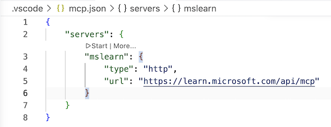

3. In the Copilot Chat panel, click the tools icon to confirm the server tools are listed.

   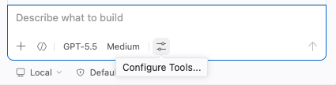

   

4. Ask a question that requires context from Microsoft Learn documentation:

   ```text
   What kind of GPUs are available for Azure Container Apps?
   ```

### GitHub Copilot CLI — public server

1. Add the MCP server using the CLI:

   ```bash
   copilot mcp add --transport http mslearn https://learn.microsoft.com/api/mcp
   ```

2. Ask a question that can be answered by the MCP server:

   ```bash
   copilot -i "What kind of GPUs are available for Azure Container Apps?"
   ```

### Claude Code — public server

1. Add the server:

   ```bash
   claude mcp add --transport http mslearn https://learn.microsoft.com/api/mcp
   ```

2. Verify it was added:

   ```bash
   claude mcp list
   ```

3. Ask a question that can be answered by the MCP server:

   ```bash
   claude "What kind of GPUs are available for Azure Container Apps?"
   ```

---

## Step 4: Use an authenticated MCP server

The goal of this step is to show you what it's like to use an MCP server that requires authentication via the MCP Auth (OAuth2) flow.

Our recommendation is to use the [Hugging Face MCP server](https://huggingface.co/mcp), as it is easy to create an account there if you don't yet have one, but you can also try other [remote servers that require OAuth](https://mcpservers.org/remote-mcp-servers). Just change the URL to match your selected server.

### GitHub Copilot in VS Code with authenticated server

1. Make sure that `.vscode/mcp.json` contains a server configuration pointed at the Hugging Face MCP server URL:

    ```json
    {
       "servers": {
          "huggingface": {
             "type": "http",
             "url": "https://huggingface.co/mcp?login"
          }
       }
    }
    ```

2. Select "Start" on the server in the config file. 

   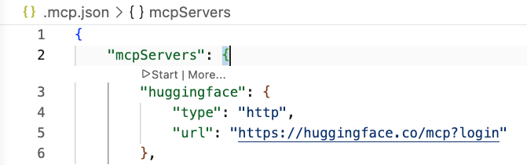

3. A prompt will pop up asking whether the MCP server can authenticate to Hugging Face. Select **Allow**.

   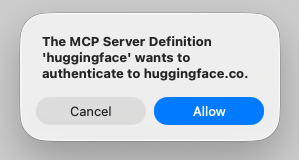

4. VS Code will ask whether it can open the external Hugging Face authorization website. Select **Open**.

   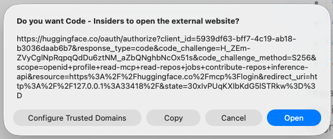

5. If you are not yet logged into Hugging Face, login or sign-in on the page that pops up.

   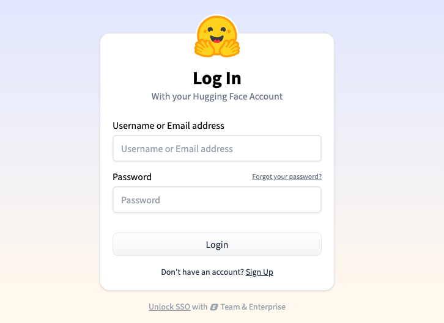

6. In the browser, select **Authorize** to grant VS Code access to Hugging Face MCP tools.

   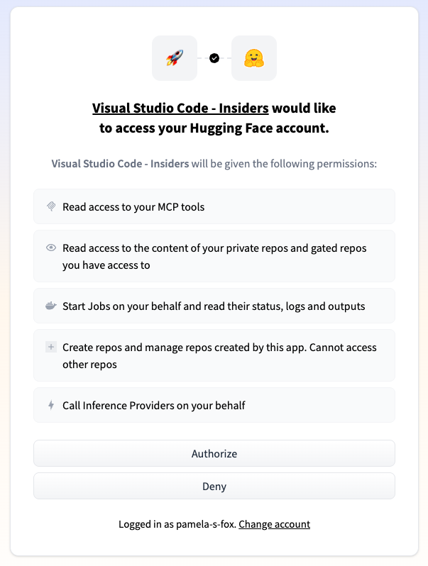

7. After authorization, the browser will ask to reopen VS Code. Select **Open**.

   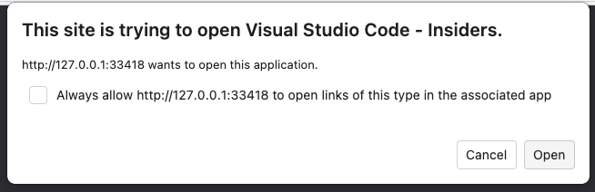

8. Back in VS Code, confirm the Hugging Face MCP server is running.

   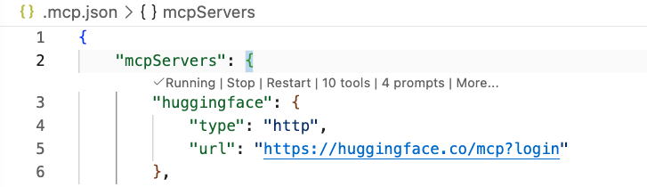

9. Click the tools icon (🔧) and confirm the Hugging Face tools are listed and enabled. 

   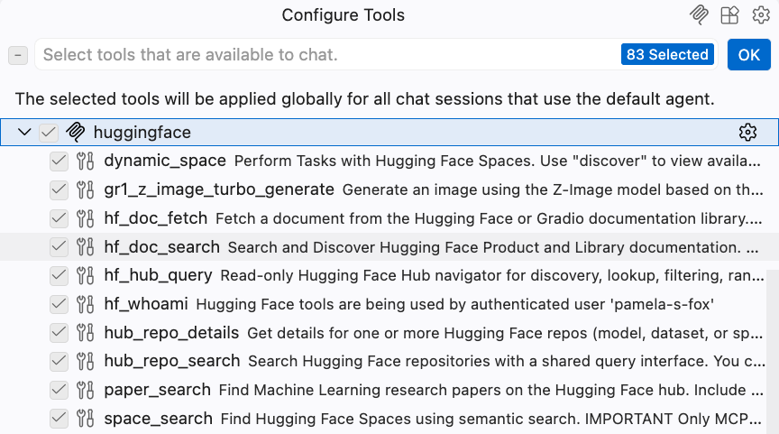

10. Ask a question that requires context from HuggingFace:

    ```text
    What recent research papers are there about MCP?
    ```

### GitHub Copilot CLI with authenticated server

1. Add the Hugging Face MCP server using the CLI:

   ```bash
   copilot mcp add --transport http huggingface 'https://huggingface.co/mcp?login'
   ```

2. Open Copilot CLI with `copilot`. It should immediately pop open the Hugging Face authorization flow in a browser.

3. If you are not yet logged into Hugging Face, login or sign-in on the page that pops up.

   

4. Select **Authorize** on the Hugging Face consent screen.

   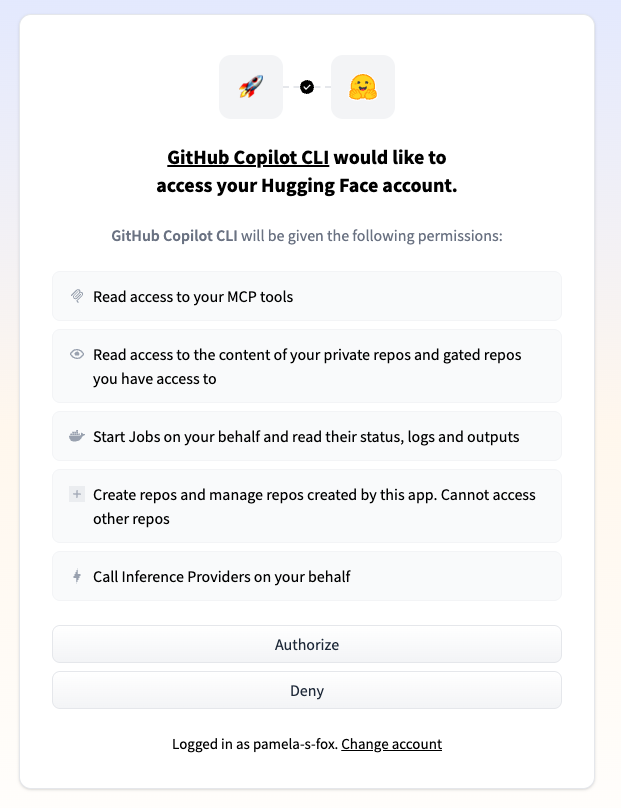

5. Back inside the Copilot CLI, run `/mcp` and you should see that the Hugging Face server is authenticated:

   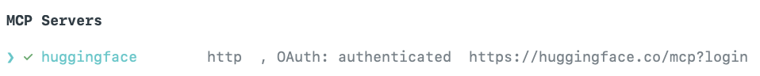

6. Ask a question that requires context from Hugging Face:

   ```text
   What recent research papers are there about MCP?"
   ```

### Claude Code with authenticated server

1. Add the Hugging Face MCP server:

   ```bash
   claude mcp add --transport http huggingface 'https://huggingface.co/mcp?login'
   ```

2. Open Claude Code with `claude` and run `/mcp` to list configured MCP servers. Select the "huggingface" server.

   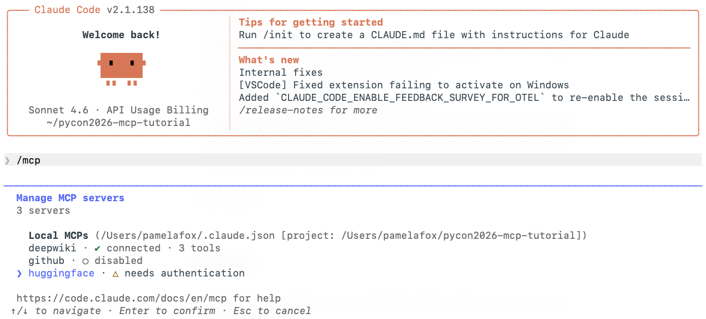

3. In the "Hugging Face MCP server" configuration screen, select "Authenticate":

   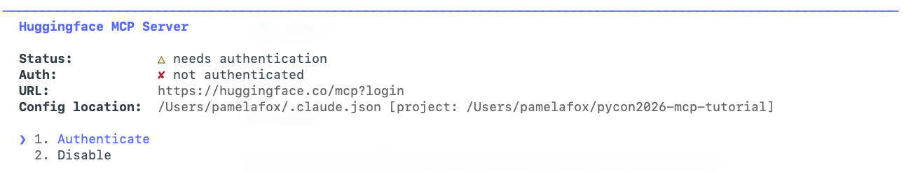

   Claude Code will start off the OAuth flow by redirecting to a browser:

   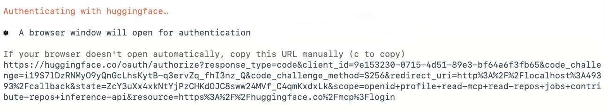

4. If you are not yet logged into Hugging Face, login or sign-in on the page that pops up:

   

5. After login, authorize Claude Code to grant access to Hugging Face:

   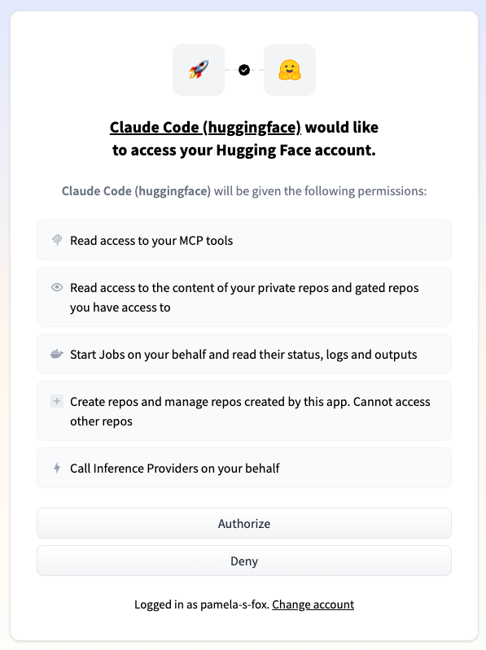

   You should see that auth was successful in both the browser and terminal:

   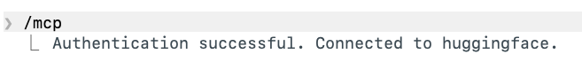

6. Ask a question that requires the server to answer:

   ```text
   What recent research papers are there about MCP?"
   ```